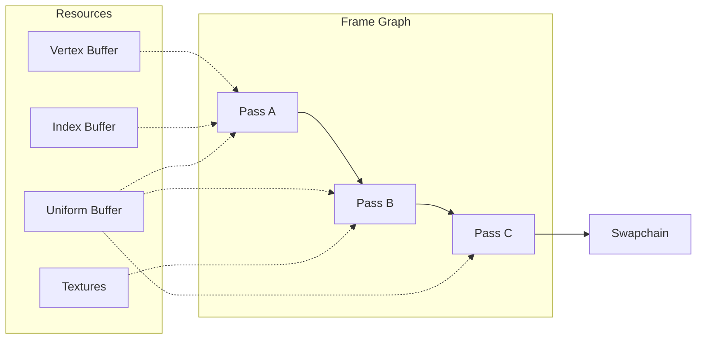

  
  <h1 class="m-0 font-display text-4xl">Triad</h1>
  

    <a href="https://github.com/jarenm1/triad" target="_blank" rel="noreferrer" class="flex items-center gap-2 underline">
      Repo
      <svg xmlns="http://www.w3.org/2000/svg" width="16" height="16" fill="none" stroke="currentColor" stroke-width="1.75" stroke-linecap="round" stroke-linejoin="round">
        <path d="M7 3h6v6" />
        <path d="M3 13 13 3" />
      </svg>
    </a>
  

I built Triad while learning about graphics programming. I originally wanted it to serve as a triangle splatting renderer to be used in some sort of autonomy stack. CUDA fits that role much better though. May repurpose Triad into a triangle splatting application at some point.

<figure>
  
  <figcaption>Goat skull PLY model in triad</figcaption>
</figure>

## Architecture

Currently the renderer uses a frame graph to order render passes and share GPU resources with a DAG. The goal is to keep passes very explicit, avoid global state, and leave room to add on compute stages.

